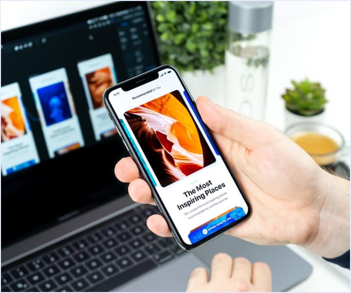

<!DOCTYPE html>
<html lang="en">
<head>
    <meta charset="UTF-8">
    <meta http-equiv="X-UA-Compatible" content="IE=edge">
    <meta name="viewport" content="width=device-width, initial-scale=1.0">
    <title>WebStudio</title>
</head>
<body>
     <!-- HEADER section 1 -->
    <header>
        <nav>
            <a href="./index.html">WebStudio</a>
            <ul>
                <li><a href="./index.html">Studio</a></li>
                <li><a href="">Portfolio</a></li>
                <li><a href="">Contacts</a></li>
            </ul>
        </nav>
        <address>
        <ul>
            <li><a href="mailto:info@devstudio.com">info@devstudio.com</a></li>
            <li><a href="tel:+110001111111">+11 {000} 111 11 11</a></li>
        </ul>
        </address>
    </header>
   <main>
       <!-- HERO section 3 -->
        <section>
        <h1>Effective solutions for your business</h1>
	<button type="button">Order a service</button>
        </section>
        <!-- List of tasks Section 4 -->
        <section>
            <h2 hidden>Pros of the company</h2>
            <ul>
                <li>
                    <h3>Attention to detail</h3>
                    
Ideological considerations, as well as the beginning of the day-to-day work of position building.

                </li>
                <li>
                    <h3>Punctuality</h3>
                    
The task of the organization, especially the scope and location of staff training entails.

                </li>
                <li>
                    <h3>Planning</h3>
                    
Equally, consultation with a broad asset largely conditions the.

                </li>
                <li>
                    <h3>Modern technologies</h3>
                    
The significance of these problems is so obvious that the realization of planned tasks.

                </li>
            </ul>
        </section>
        <!-- What we do section 5 -->
        <section>
            <h2>What we do</h2>
            <ul>
                <li></li>
                <li></li>
                <li></li>
            </ul>

        </section>

   <!-- Our team section 6 -->
   <section>
<h2>Our team</h2>
<ul>
    <li>
        
        <h3>igor demjanenko</h3>
        
Product Designer

    </li>
    <li>
        
        <h3>olga repina</h3>
        
Frontend Developer

    </li>
    <li>
        
        <h3>nikolay tarasov</h3>
        
Marketing

    </li>
    <li>
        
        <h3>Mikhail Ermakov</h3>
        
UI Designer

    </li>
</ul>
   </section>
    </main>
    <footer>
        <a href="./index.html">WebStudio</a>
        <address>
            <ul>
                <li>
                    <a href="https://goo.gl/maps/SxN2yB6NeiDHtefY7" target="_blank" rel="noopener noreferrer">г. Киев, пр-т Леси Украинки, 26</a>
                </li>
                <li>
                    <a href="mailto:info@example.com">info@example.com</a>
                </li>
                <li>
                    <a href="tel:+110001111111">+11 {000} 111 11 11</a>
                </li>
            </ul>
        </address>
    </footer>
</body>
</html>
